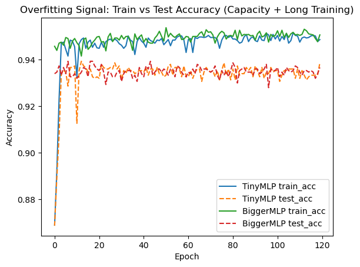

# Optimization in Deep Learning  
**Learning Rates, Stability, Generalization, and Drift**

This repository contains a focused set of experiments exploring how optimization
choices affect machine learning models in practice.

Rather than tuning architectures or chasing marginal accuracy gains, this work
looks at the **mechanics of training itself** — learning rates, optimizers,
schedules, and what happens when real-world assumptions break.

The notebook is fully executed and answered, with results interpreted directly
from the observed behavior.

---

## 🔬 What’s Inside

The experiments cover both theory-aligned and real-world scenarios:

- Convex optimization using Logistic Regression  
- Non-convex optimization using a small MLP  
- Learning rate magnitude and convergence behavior  
- SGD vs Adam under identical conditions  
- Constant vs decaying learning rate schedules  
- Overfitting and generalization gaps  
- Concept drift and post-deployment accuracy loss  

Each section pairs visual results with written analysis.

---

## 📊 Visual Highlights

Below are selected snapshots from the experiments to give a quick sense of
what’s being explored.

### Learning Rate Effects (Convex)

### Optimizer Stability (Non-Convex)

### Training vs Test Accuracy

### Learning Rate Scheduling

### Concept Drift Impact

---

## 📈 Key Observations

- Convex loss functions can still fail to converge with poor learning rates  
- Non-convex optimization is highly sensitive to optimizer choice  
- Adam converges more consistently than SGD in unstable regions  
- Training accuracy alone is a weak indicator of real performance  
- Data distribution drift can significantly reduce accuracy without code changes  

These behaviors mirror what happens in production ML systems.

---

## 🧠 Why This Matters

In real deployments, models don’t fail because the architecture is wrong —
they fail because assumptions break.

This notebook highlights why:
- optimization choices matter as much as model design  
- monitoring is required after deployment  
- retraining decisions must be data-driven  

Understanding these dynamics is essential for building reliable ML systems.

---

## 🛠️ Tools Used

- Python  
- PyTorch  
- NumPy  
- Matplotlib  

---

## 📁 Files

- `learning_rate_optimization.ipynb`  

---

## 👤 Author

**Cordell Stonecipher**  
AI / Machine Learning  
Focus: optimization behavior, training dynamics, and model reliability
